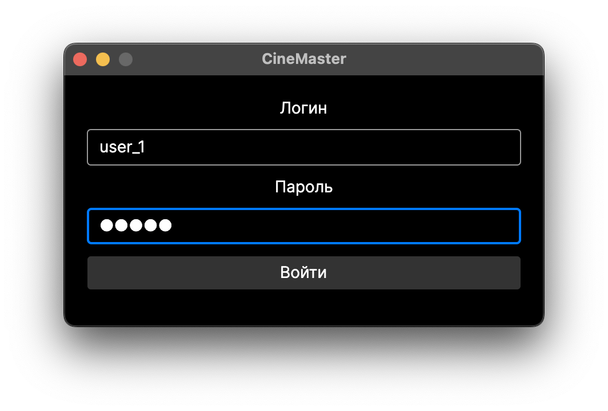
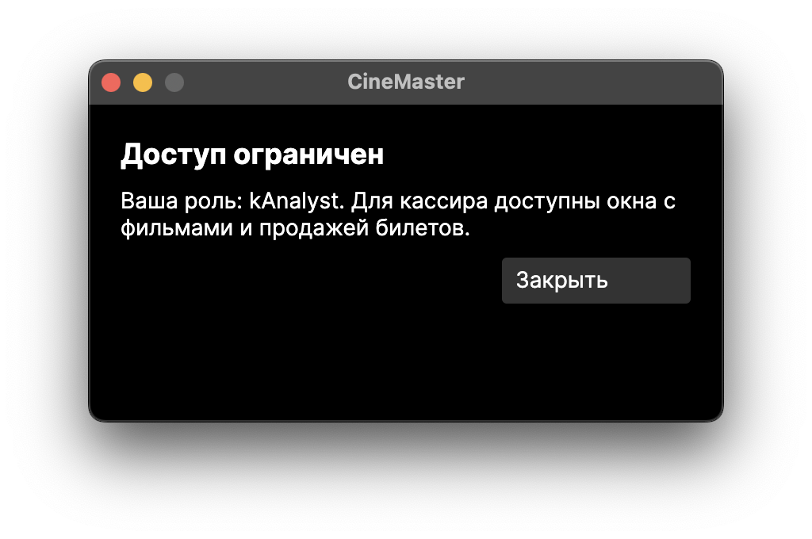
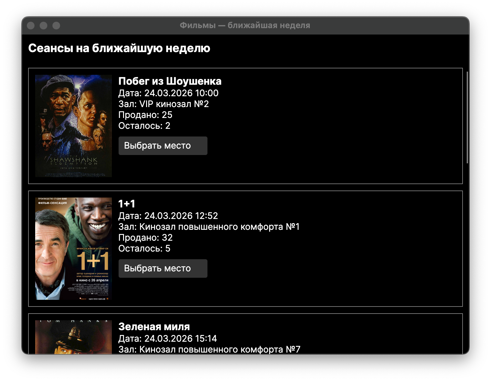
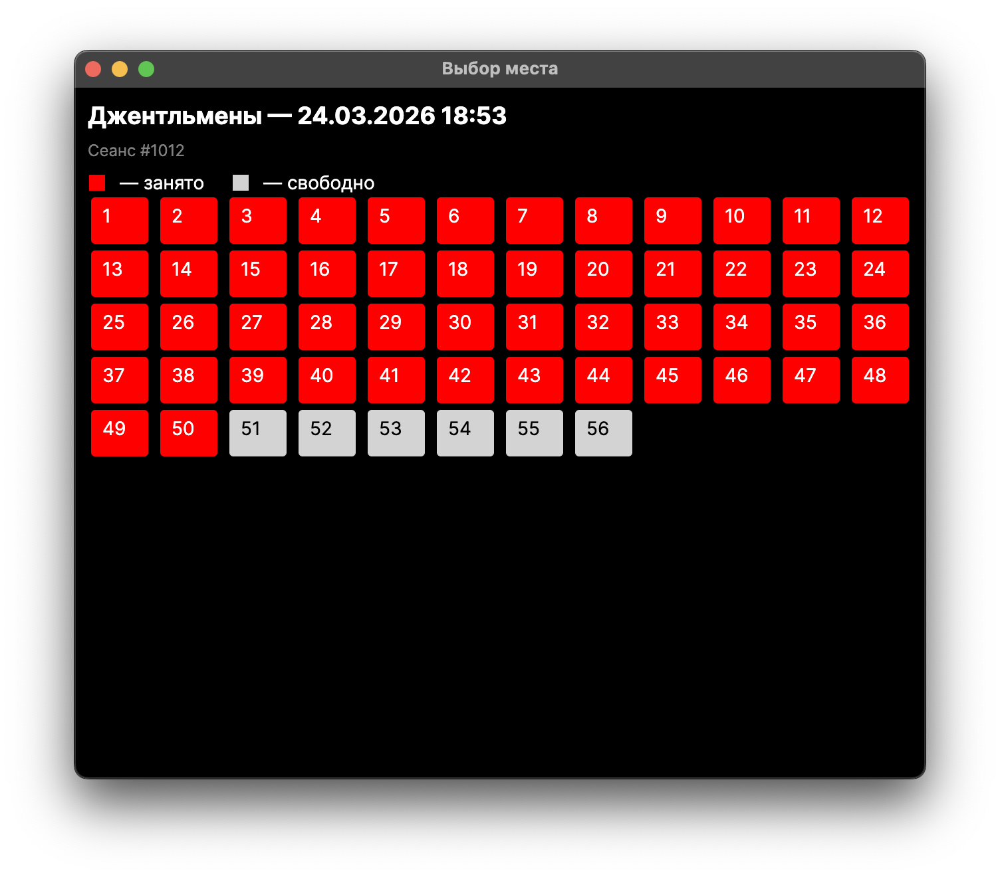
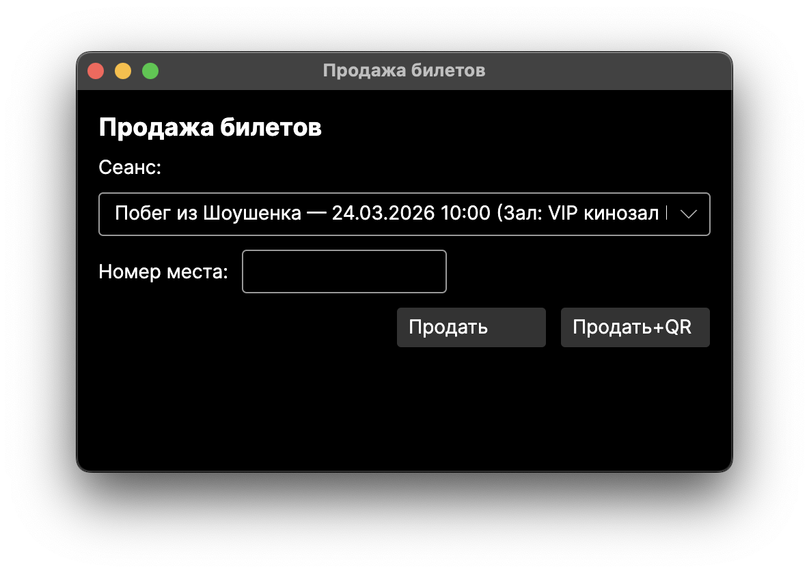
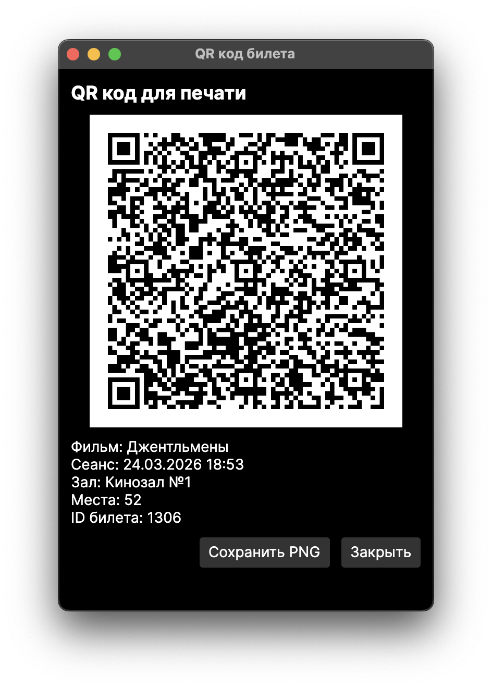

# Состав программного комплекса

Программный комплекс CineMaster представляет клиент-серверную архитектуру с распределенным приложением.
Основная логика работы с БД расположена на сервере, к которому обращается клиент для получения данных.
Серверное приложение представленно в виде HTTP-сервера, а клиентское в виде настольного приложения с графической оболочкой.

Конфигурирование подключения клиентского ПО к серверному модулю регулируется за счет файла serverConfig.json, в котором указывается адрес сервера.

## Клиенский модуль CineMaster-frontend
### Окно авторизации



В данном окне пользователю необходимо ввести логин и пароль в соответствующие текстовые поля и нажать кнопку "Войти". После чего откроется окно программы соответсвующее роли пользователя. Так например при попытке входа пользователем, который не относится к роли кассира будет открыто окно-заглушка, которое сообщит о роли пользователя.



Для роли кассира будут предложены окна киноафиши, продажи билетов и выбора мест.

Для выхода пользователя из системы необходимо закрыть приложение CineMaster-frontend.

### Окно киноафиши

Главное окно, которое должно быть представлено перед клиентами кинотеатра, на нем представлены все ближайшие сеансы с возможностью дальнейшего просмотра занятых мест.



Для просмотра занятых мест необходимо нажать на кнопку "Выбрать место".



Данное окно представлено исключительно для визуализации данных и синхронизируется с окном продажи билетов.

### Окно продажи билетов

Рабочее окно в котором кассир осуществляет продажу билетов, в котором необходимо:
1. Выбрать фильм из выпадающего списка
2. Указать в текстовом поле номер места
3. Нажать кнопку "Продать"
После выполненных действий в окне просмотра занятых мест обновятся занятые места для выбранного фильма.



Кнопка "Продать + QR" необходима для формирования QR-кода с основной информацией билета, для возможности дальнейшей автоматизации на стадии проверки билетов при посещении сеанса. В QR-коде находится JSON структура следующего плана:

```json
{
  "TicketId": "1306",
  "SessionId": 1012,
  "FilmName": "Джентльмены",
  "ShowingTime": "2026-03-24T18:53:00",
  "HallName": "Кинозал №1",
  "Seats": [
    52
  ]
}
```

